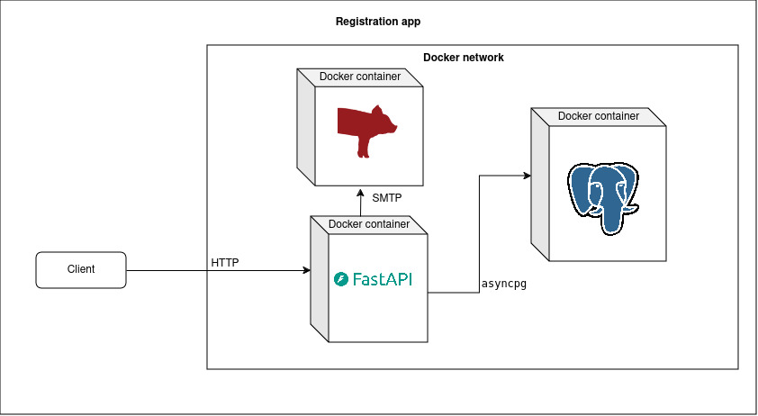

# FastAPI App with PostgreSQL Database

This is a user registration FastAPI application with a PostgreSQL database, deployed using Docker Compose.

## Prerequisites

- [Docker](https://www.docker.com/) installed on your machine.

## Getting Started

1. Clone the repository:

    ```bash
    git clone https://github.com/souheyltoumi/registration-app.git
    cd registration-app
    ```

2. Run the application with Docker Compose:

    ```bash
    docker-compose up --build
    ```
    2.a. Run the application with Docker Compose in the backgroud
    ```
    docker-compose up -d
    ```

3. The FastAPI application should now be running. Access the API at [http://localhost:6009](http://localhost:6009).
4. The MailHog server (SMTP) should now be running. Access the web view at [http://localhost:1025](http://localhost:1025).


## Usage

- Open your web browser and go to [http://localhost:6009/docs](http://localhost:6009/docs) to access the Swagger UI.
- Use the Swagger UI to interact with the API endpoints.
- You can also send requests directly to the API endpoints using tools like `curl` or Postman.

## Available Routes

- `/users/registration`: to create a new user account
- `/users/activation`: to activate a user account (token expiration within 1 minute)
- `/users/refresh`: to refresh account token

## Shutting Down the Application

To shut down the application and remove the containers, press `Ctrl + C` in the terminal where `docker-compose` is running.

To remove the Docker volumes (including the database data), run:

```bash
docker-compose down -v
```

## Architecture



